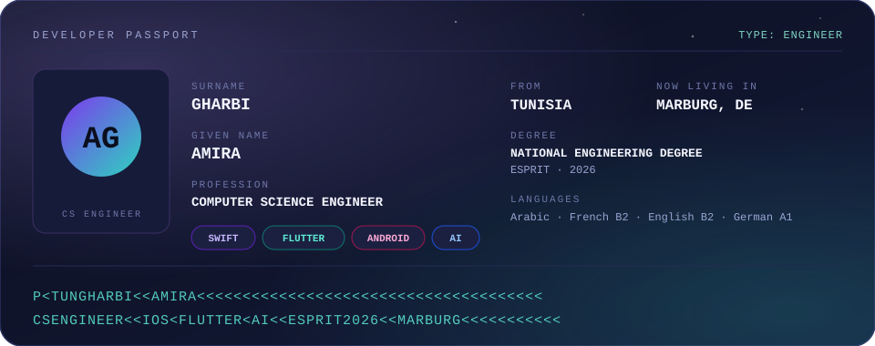
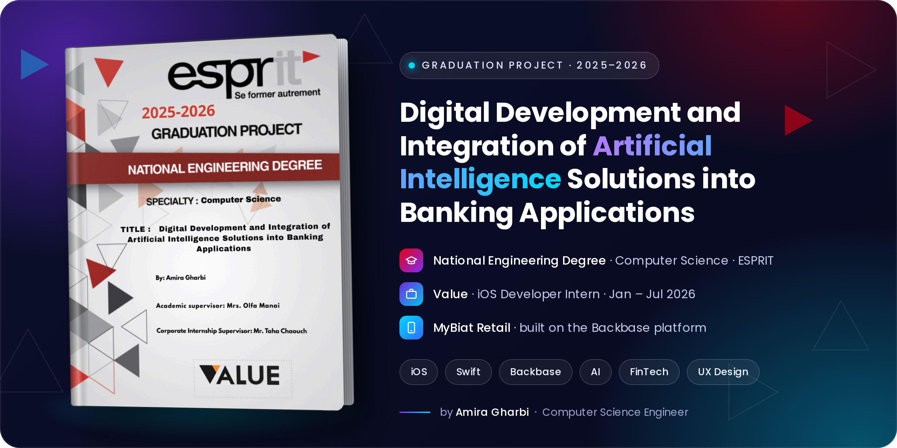

  

🎓 National Engineering Degree 2026 &nbsp;•&nbsp; 🏦 Backbase Launchpad ✅ &nbsp;•&nbsp; 🟢 NVIDIA Deep Learning Prep ✅ &nbsp;•&nbsp; 🏆 Top 2 — ChoubikLoubik

---

## 🛂 My Passport

  

---

## 📍 Current Location

- 🎓 Studying at **Philipps University of Marburg** in Germany
- 🇩🇪 Learning German (**A1**), step by step
- 🤝 Open to collaboration opportunities

---

## 🎓 Graduation Project — AI in Banking

<table>
<tr>
<td width="38%" align="center" valign="middle">
  
</td>
<td width="64%" valign="top">

### Digital Development and Integration of Artificial Intelligence Solutions into Banking Applications

🏛️ **ESPRIT** — National Engineering Degree, Computer Science (2025–2026) 
🏢 **Value** — Lac 1, Tunis 🇹🇳 · On-site · Jan – Jul 2026 
📱 **Role:** Mobile iOS Developer Intern | AI-Powered Banking Applications

🏦 Enhancing the **MyBiat Retail** app as an iOS developer, built on the **Backbase** platform 
🚀 Completed the **Backbase Launchpad** — 20 modules on Journeys, UI and business logic, Integration of Artificial Intelligence Solutions

</td>
</tr>
</table>

---

## 🛃 Passport Stamps

Every stamp is a place where I worked and learned. Tap one to open it.

🛂 <b>VALUE</b> &nbsp;·&nbsp; Tunis, Tunisia 🇹🇳 &nbsp;·&nbsp; Jan – Jul 2026 &nbsp;·&nbsp; <i>iOS Developer Intern</i>

 

Graduation internship — AI-powered banking applications. On-site.

- Working as an iOS developer on the **MyBiat Retail** banking app
- Completed the **Backbase Launchpad** training (20 modules: Journeys, UI, business logic)
- Focus on iOS design and user experience
- Integration of Artificial Intelligence Solutions

`Swift` `iOS` `Backbase` `Postman` `UX`

🛂 <b>ITSPARK</b> &nbsp;·&nbsp; Alexandria, Egypt 🇪🇬 &nbsp;·&nbsp; Jul 2025 – Jul 2026 &nbsp;·&nbsp; <i>Flutter Developer Intern</i>

 

Hybrid. Worked on two projects: **eMart** and **EgyCoPt**.

- **eMart** — one codebase that powers many online stores
- **EgyCoPt** — event discovery and booking app
- Figma UI/UX, Flutter mobile app, TypeScript backend, Azure data layer

`Flutter` `TypeScript` `Azure` `Firebase` `Figma`

🛂 <b>EXYPNOTECH</b> &nbsp;·&nbsp; Tunisia 🇹🇳 &nbsp;·&nbsp; Jun – Aug 2024 &nbsp;·&nbsp; <i>Mobile Developer Intern</i>

 

Hybrid. Built a mobile application for managing fish crates for fishermen.

- Flutter front-end with an Express.js back-end and MongoDB database
- UI/UX designed in Figma for an intuitive, user-friendly experience

`Flutter` `Express.js` `MongoDB` `Figma`

🛂 <b>ESPRIT</b> &nbsp;·&nbsp; Tunisia 🇹🇳 &nbsp;·&nbsp; Oct 2023 – May 2024 &nbsp;·&nbsp; <i>Academic Project</i>

 

Hybrid desktop/web application (**ChoubikLoubik** — 🏆 Top 2 Winner).

- Symfony + JavaFX for seamless interaction between interfaces
- AI integration to optimize order management and customer service

`Symfony` `JavaFX` `Firebase` `Unity (VR)` `AI API`

🛂 <b>PROXYM</b> &nbsp;·&nbsp; Tunisia 🇹🇳 &nbsp;·&nbsp; Jul – Aug 2023 &nbsp;·&nbsp; <i>AI Developer Intern</i>

 

Hybrid. Developed an intelligent banking chatbot as a mobile application.

- Conversational AI with natural language processing
- Firebase backend for real-time responses

`React` `Firebase` `AI API`

---

## 🧳 Built Along the Way

<table>
<tr>
<td colspan="2" align="center">

### 🛍️ eMart — *One Code, Endless Stores!* 🚀
**Built at ITSpark, Alexandria 🇪🇬**

A modern e-commerce platform to create and manage **multiple online stores from a single codebase** — fast, flexible and beautifully built.

🎨 Figma UI/UX &nbsp;·&nbsp; 📱 Flutter app &nbsp;·&nbsp; ⚙️ TypeScript APIs &nbsp;·&nbsp; ☁️ Azure Data Studio &nbsp;·&nbsp; 🛠️ Modular multi-store architecture

</td>
</tr>
<tr>
<td width="50%" valign="top">

### 🎫 EgyCoPt
**Event Booking Platform**

A mobile app for discovering and booking Christian events across Egypt.

`Flutter (MVVM)` `Firebase` `Azure` `Figma`

</td>
<td width="50%" valign="top">

### 🐟 Fish Crate Manager
**Mobile App for Fishermen**

Helps fishermen manage and track their fish crates.

`Flutter` `Express.js` `MongoDB` `Figma`

</td>
</tr>
<tr>
<td width="50%" valign="top">

### 🍽️ ChoubikLoubik — 🏆 Top 2
**AI Restaurant System**

Voice interaction, an intelligent chatbot, and a VR training module for staff.

`Symfony` `JavaFX` `Firebase` `Unity (VR)` `AI API`

</td>
<td width="50%" valign="top">

### 🏦 Banking Chatbot
**AI Assistant for Banking**

A conversational mobile assistant built during my internship at Proxym.

`React` `Firebase` `AI API`

</td>
</tr>
<tr>
<td width="50%" valign="top">

### 🧩 AlzMind
**AI Companion for Alzheimer's**

A 3D avatar, voice assistant, GPS tracking and caregiver communication.

`Flutter` `TypeScript` `MongoDB` `Firebase` `AI API`

</td>
<td width="50%" valign="top">

### 💞 Cosmia
**Astrology-Based Dating App**

Secure authentication, facial recognition and real-time matching.

`Flutter` `iOS` `Android` `MongoDB` `Firebase` `AI API`

</td>
</tr>
</table>

---

## 🎒 Packed in My Suitcase

**📱 Mobile** 

**💻 Languages** 

**⚙️ Backend & Frameworks** 

**☁️ Databases & Cloud** 

**🧰 Tools** 

---

## 📜 Certificates & Visas

| | Certification | Status |
|:---:|:---|:---:|
| 🇬🇧 | **IELTS** · English — level **B2** | ✅ |
| 🇫🇷 | **TCF TP** · French — level **B2** | ✅ |
| 🧠 | **Certified in Deep Learning** · [NVIDIA](https://www.linkedin.com/company/nvidia/) through [GOMYCODE](https://www.linkedin.com/company/gomycode/) | ✅ |
| 🌐 | **Cisco Networking Academy** · [Cisco](https://www.linkedin.com/company/cisco/) | ✅ |
| 🛠️ | **Applications of AI for Predictive Maintenance** · [NVIDIA](https://www.linkedin.com/company/nvidia/) | ✅ |
| ☁️ | **AWS Academy Graduate** · AWS Academy | ✅ |
| 🤝 | **Leadership Development** · [AIESEC](https://www.linkedin.com/company/aiesec/) | ✅ |
| 🎨 | **Generative AI with Diffusion Models** · [NVIDIA](https://www.linkedin.com/company/nvidia/) | ✅ |
| 🔗 | **Hashgraph Developer** · [The Hashgraph Association](https://www.linkedin.com/company/the-hashgraph-association/) | ✅ |

---

## 📊 Travel Log

  
 
    
  

---

### 🌍 Next destination: your project?
*Let's build smart, beautiful apps together.*

[LinkedIn](https://www.linkedin.com/in/amira-gharbi/) &nbsp;·&nbsp; [Email](mailto:amira.gharbi@esprit.tn) &nbsp;·&nbsp; [GitHub](https://github.com/amiragharb)

