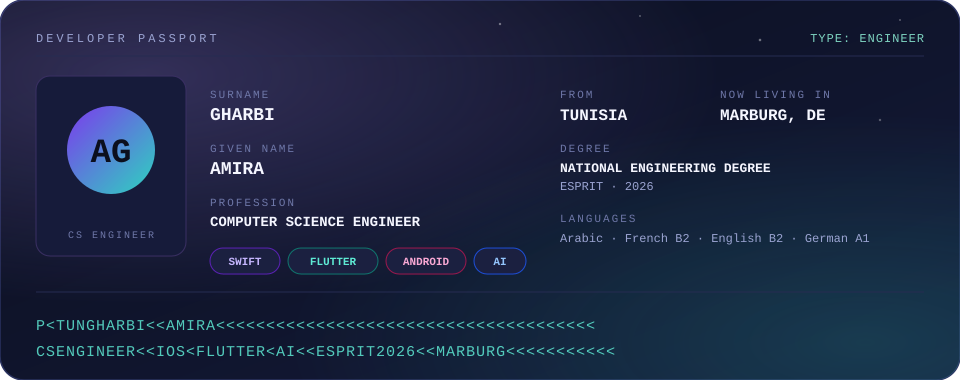
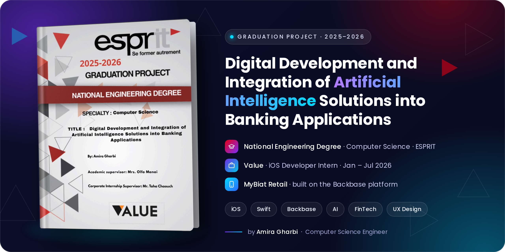

  

🎓 National Engineering Degree 2026 &nbsp;•&nbsp; 🏦 Backbase Launchpad ✅ &nbsp;•&nbsp; 🟢 NVIDIA Deep Learning Prep ✅ &nbsp;•&nbsp; 🏆 Top 2 — ChoubikLoubik

---

## 🛂 My Passport

  

---

## 📍 Current Location

- 🎓 Studying at **Philipps University of Marburg** in Germany
- 🇩🇪 Learning German (**A1**), step by step
- 🤝 Open to collaboration opportunities

---

## 🎓 Graduation Project — AI in Banking

<table>
<tr>
<td width="38%" align="center" valign="middle">
  
</td>

<td width="62%" valign="top">

### Digital Development and Integration of Artificial Intelligence Solutions into Banking Applications

🏢 **VALUE** — Lac 1, Tunis 🇹🇳 · On-site · Jan – Jul 2026  
📱 **Role:** Mobile iOS Developer Intern | AI-Powered Banking Applications

Contributed to the development and enhancement of the **MyBiat Retail** mobile banking application as an **iOS Developer**, built on the **Backbase** platform, with a focus on integrating AI-powered solutions.

🚀 Successfully completed the **Backbase Launchpad**, covering 20 modules focused on **Journeys, UI development, business logic, and AI solution integration**.

</td>
</tr>
</table>

---

## 🛃 Passport Stamps

Every stamp is a place where I worked and learned. Tap one to open it.

🛂 <b>VALUE</b> &nbsp;·&nbsp; Tunis, Tunisia 🇹🇳 &nbsp;·&nbsp; Jan – Jul 2026 &nbsp;·&nbsp; <i>iOS Developer Intern</i>

 

Graduation internship — **AI-powered banking applications**. On-site.

- 🏦 Developed and enhanced the **MyBiat Retail** banking application as an iOS developer
- 🔗 Worked with the **Backbase** platform and completed the **Backbase Launchpad** training, covering 20 modules in Journeys, UI, and business logic
- 💬 Integrated an **AI Chatbot** for conversational banking assistance
- 🎙️ Contributed to **Voice Banking** for voice-based interaction with banking services
- 🪪 Contributed to **AI-powered KYC** for the Know Your Customer verification process
- 🎨 Focused on iOS development, user experience, and seamless integration of AI capabilities

`Swift` `iOS` `Backbase` `AI` `Chatbot` `Voice Banking` `KYC` `Postman` `UX`

🛂 <b>ITSPARK</b> &nbsp;·&nbsp; Alexandria, Egypt 🇪🇬 &nbsp;·&nbsp; Jul 2025 – Jul 2026 &nbsp;·&nbsp; <i>Flutter Developer Intern</i>

 

Hybrid. Worked on two mobile applications: **eMart** and **EgyCoPt**.

- 🛍️ **eMart** — Developed a scalable **multi-store e-commerce platform** using a single codebase, allowing businesses to create and manage multiple online stores
  - Designed intuitive **UI/UX flows and interfaces** using Figma
  - Developed the mobile application with **Flutter**
  - Built and integrated **TypeScript APIs** for frontend–backend communication
  - Worked with **Azure Data Studio** for data management
  - Applied a **modular architecture** to support customization and multi-store deployment

- 🎟️ **EgyCoPt** — Modernized and redesigned an existing application for **Christian events and appointment booking**
  - Redesigned the application from an older version with a modern **UI/UX**
  - Rebuilt and updated the **Flutter mobile application**
  - Implemented user flows for discovering events and **booking appointments**
  - Improved the overall user experience and application structure

`Flutter` `Dart` `TypeScript` `Azure` `Firebase` `Figma` `UI/UX` `REST APIs`

🛂 <b>EXYPNOTECH</b> &nbsp;·&nbsp; Tunisia 🇹🇳 &nbsp;·&nbsp; Jun – Aug 2024 &nbsp;·&nbsp; <i>Mobile Developer Intern</i>

 

Hybrid. Developed a mobile application for **managing fish crates and operations for fishermen**.

- 🎨 Designed the application's **UI/UX from scratch using Figma**, focusing on intuitive navigation and a user-friendly experience
- 📱 Developed the mobile application with **Flutter**, implementing the designed interfaces and core functionality
- ⚙️ Built and integrated an **Express.js backend** with a **MongoDB database**
- 🔄 Connected the Flutter application with backend services for efficient data management

`Flutter` `Dart` `Express.js` `MongoDB` `Figma` `UI/UX`

🛂 <b>ESPRIT</b> &nbsp;·&nbsp; Tunisia 🇹🇳 &nbsp;·&nbsp; Oct 2023 – May 2024 &nbsp;·&nbsp; <i>Academic Projects</i>

 

Hybrid academic projects developed as part of the **Integrated Mobile Project (PIM)** at **ESPRIT**.

- 🧠 **AlzMind** — AI-powered mobile application designed to support people with **Alzheimer’s disease and their caregivers**
  - 📱 Cross-platform mobile application developed with **Flutter**
  - 🤖 Integrated AI technologies including **OpenAI, Gemini, D-ID, HeyGen, and Ready Player Me**
  - 🧠 Implemented personalized memory support, cognitive games, smart reminders, and **AI-based risk detection**
  - 👁️ Integrated **YOLOv8 and TensorFlow Lite** for on-device object recognition
  - 🎙️ Added **voice assistance** and AI-powered interactions through a 3D avatar
  - ⌚ Integrated wearable devices for monitoring health-related data such as movement and sleep
  - 💬 Implemented real-time communication between families and caregivers using **Firebase**
  - ⚙️ Developed the backend with **NestJS** and **MongoDB**

- 🏆 **ChoubikLoubik** — Desktop/web application and **Top 2 winning academic project**
  - Developed with **Symfony** and **JavaFX**
  - Integrated AI solutions to improve **order management and customer service**
  - Used **Firebase** and AI APIs for application services

`Flutter` `Dart` `NestJS` `MongoDB` `Symfony` `JavaFX` `Firebase` `OpenAI` `Gemini` `YOLOv8` `TensorFlow Lite` `AI` `Unity (VR)`

🛂 <b>PROXYM</b> &nbsp;·&nbsp; Tunisia 🇹🇳 &nbsp;·&nbsp; Jul – Aug 2023 &nbsp;·&nbsp; <i>AI Developer Intern</i>

 

Hybrid. Developed an **AI-powered banking chatbot** as a mobile application.

- 🤖 Developed a conversational AI assistant designed to handle **banking-related questions and interactions**
- 🧠 Integrated **Natural Language Processing (NLP)** to understand user requests and generate relevant responses
- 📱 Developed the mobile application using **React**
- 🔥 Integrated **Firebase** for backend services and real-time communication
- 🔗 Connected the application with **AI APIs** to enable intelligent conversational capabilities

`React` `JavaScript` `Firebase` `NLP` `AI API` `Conversational AI`

---

## 🧳 Built Along the Way

<table>
<tr>
<td colspan="2" align="center">

### 🛍️ eMart — *One Code, Endless Stores!* 🚀

**Built at ITSpark, Alexandria 🇪🇬**

A modern e-commerce platform to create and manage **multiple online stores from a single codebase** — fast, flexible and beautifully built.

🎨 Figma UI/UX &nbsp;·&nbsp; 📱 Flutter app &nbsp;·&nbsp; ⚙️ TypeScript APIs &nbsp;·&nbsp; ☁️ Azure Data Studio &nbsp;·&nbsp; 🛠️ Modular multi-store architecture

</td>
</tr>

<tr>
<td width="50%" valign="top">

### 🎫 EgyCoPt

**Event Booking Platform**

A mobile app for discovering and booking Christian events across Egypt.

`Flutter (MVVM)` `Firebase` `Azure` `Figma`

</td>

<td width="50%" valign="top">

### 🐟 Fish Crate Manager

**Mobile App for Fishermen**

Helps fishermen manage and track their fish crates.

`Flutter` `Express.js` `MongoDB` `Figma`

</td>
</tr>

<tr>
<td width="50%" valign="top">

### 🍽️ ChoubikLoubik — 🏆 Top 2

**AI Restaurant System**

Voice interaction, an intelligent chatbot, and a VR training module for staff.

`Symfony` `JavaFX` `Firebase` `Unity (VR)` `AI API`

</td>

<td width="50%" valign="top">

### 🏦 Banking Chatbot

**AI Assistant for Banking**

A conversational mobile assistant built during my internship at Proxym.

`React` `Firebase` `AI API`

</td>
</tr>

<tr>
<td width="50%" valign="top">

### 🧩 AlzMind

**AI Companion for Alzheimer's**

A 3D avatar, voice assistant, GPS tracking and caregiver communication.

`Flutter` `TypeScript` `MongoDB` `Firebase` `AI API`

</td>

<td width="50%" valign="top">

### 💞 Cosmia

**Astrology-Based Dating App**

Secure authentication, facial recognition and real-time matching.

`Flutter` `iOS` `Android` `MongoDB` `Firebase` `AI API`

</td>
</tr>
</table>

---

## 🎒 Packed in My Suitcase

**📱 Mobile** 

**💻 Languages** 

**⚙️ Backend & Frameworks** 

**☁️ Databases & Cloud** 

**🧰 Tools** 

---

## 📜 Certificates & Visas

| | Certification | Status |
|:---:|:---|:---:|
| 🇬🇧 | **IELTS** · English — level **B2** | ✅ |
| 🇫🇷 | **TCF TP** · French — level **B2** | ✅ |
| 🧠 | **Certified in Deep Learning** · [NVIDIA](https://www.linkedin.com/company/nvidia/) through [GOMYCODE](https://www.linkedin.com/company/gomycode/) | ✅ |
| 🌐 | **Cisco Networking Academy** · [Cisco](https://www.linkedin.com/company/cisco/) | ✅ |
| 🛠️ | **Applications of AI for Predictive Maintenance** · [NVIDIA](https://www.linkedin.com/company/nvidia/) | ✅ |
| ☁️ | **AWS Academy Graduate** · AWS Academy | ✅ |
| 🤝 | **Leadership Development** · [AIESEC](https://www.linkedin.com/company/aiesec/) | ✅ |
| 🎨 | **Generative AI with Diffusion Models** · [NVIDIA](https://www.linkedin.com/company/nvidia/) | ✅ |
| 🔗 | **Hashgraph Developer** · [The Hashgraph Association](https://www.linkedin.com/company/the-hashgraph-association/) | ✅ |

---

## 📊 Travel Log

---

### 🌍 Next destination: your project?

*Let's build smart, beautiful apps together.*

[LinkedIn](https://www.linkedin.com/in/amira-gharbi/) &nbsp;·&nbsp; [Email](mailto:amira.gharbi@esprit.tn) &nbsp;·&nbsp; [GitHub](https://github.com/amiragharb)

